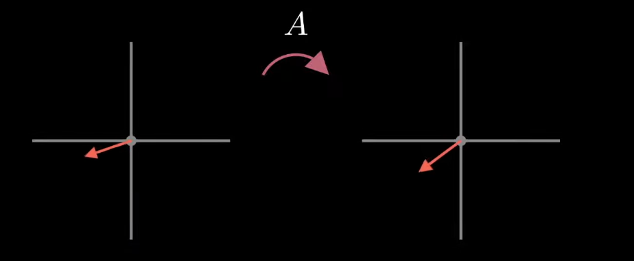
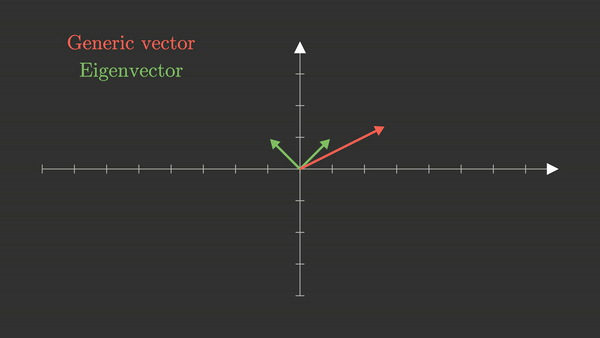
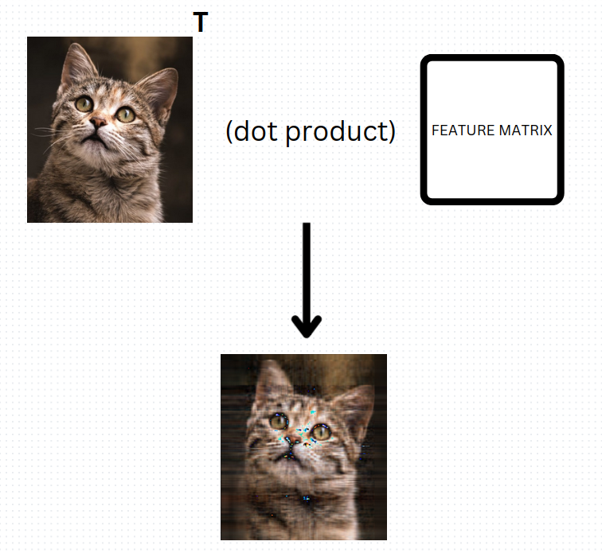
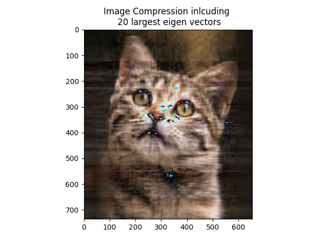
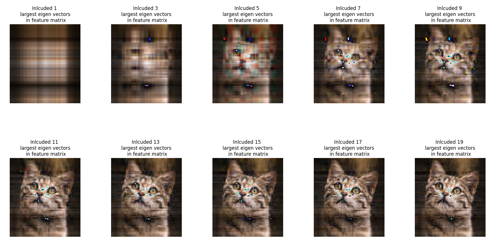
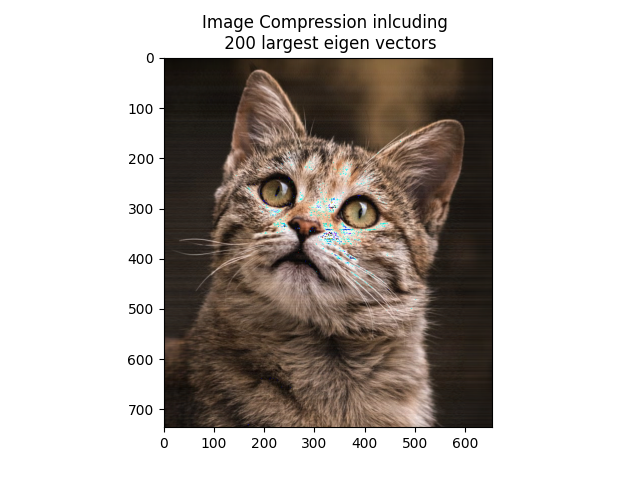
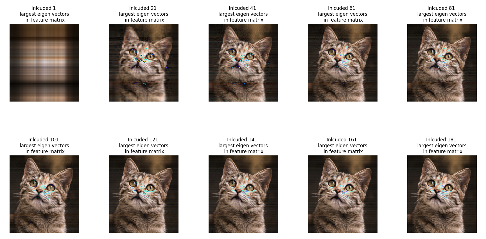

# PCA

PCA stands for Principal Component Analysis. It is one of the populat methods for dimensionality reduction i.e transforming higer dimension data into lower dimension for storage or visualization.

For this task I am doing image compression using PCA, which is similar to previous task ( image compression using SVD).


For a `2D point`, it has two features but since we are doing this for image there will `width` * `height` features. Now ,we find how the features vary among themselves . For that we find the covariance o fthe image matrix.

**For a 2D point**

 
```math
\mathbf{Cov} =   
\begin{bmatrix}
\text{Cov}(x_1, x_1) & \text{Cov}(x_1, x_2) \\
\text{Cov}(x_2, x_1) & \text{Cov}(x_2, x_2) \\
\end{bmatrix}
```
 

For a RGB image, we seperate the images into different channels and compress them individually.

`Code Implementation`

```python
channel_cov =  np.cov(channel_img)
```

Now our next step is to find the eigen vectors. There are `n` eigenvalues / eigenvectors for a covariance matrix with `n` features.The eigenvectors of a covariance matrix point at the direction along which the maximum variance can be retained. The amount of variance retained by each eigenvector depends on its corresponding eigenvalue. Eigenvectors corresponding to the larger eigenvalues retain more variance than the ones with smaller eigenvalues.


### Eigen Vectors and eigen values

We know a matrix transforms image into different shapes . We did this in Task8 of image transformation.



Here, above a vector is transformed by some random matrix `A`. So any matrix multiplication can be thought of as a linear transformation. In above figure , the direction of vector has also changed, but if it hadn't changed then it would have been the eigen vector of A.



Here, any generic vector will be displaced of their span but eigen vector won't. The eigen values are the length by which they stretch in their span.


**Code Implementation**

```python
channel_eigen_vals, channel_eigen_vectors = np.linalg.eig(channel_cov)
channel_feature_matrix = channel_eigen_vectors[:,:principal_component_number]
```

Now if we want to compress the image, we choose the eigenvector corresponding to largest eigenvalue as there will be more variance in the direction of that eigenvector. So, using the eigenvectors corresponding to larger eigen values, we create a feature matrix, which will be used to compress the image into lower dimension.

```math
\mathbf{U} = \begin{bmatrix}
| & | & | & |\\
\mathbf{pc_{largest}}\ & \mathbf{pc_{2nd-largest}}\ &.... & \mathbf{pc_k}\\
| & | & | & |\\
\end{bmatrix}

```

Principal components are the eigen vectors arranged in the decreasing order of their corresponding eigenvalues. The last eigen vector has the least variance and can be discarded.


## Projecting the data into the Principal Components

We create a feature matrix that stores the first `n` principal components to create a matrix `U`

```math
\mathbf{U} = \begin{bmatrix}
| & | & | & |\\
\mathbf{pc_1}\ & \mathbf{pc_2}\ &.... & \mathbf{pc_k}\\
| & | & | & |\\
\end{bmatrix}

```
Then we do dot product of this matrix `U` with the transposed image matrix to get the compressed image matrix.

```python
pca_channel =   np.dot(channel_img.T , channel_feature_matrix)
```




**For RGB Image**  

We perform all the steps of above on individual channels and then merge them.

```python
compressed_image = np.stack((channels[0], channels[1],channels[2]), axis=2)
compressed_image = compressed_image.astype(np.uint8)
```


## Results : 

### Including 20 largest eigen vectors in feature matrix




### Including 200 largest eigen vectors in feature matrix






## Sample Bash Command

```bash
python main.py -n 200 --path cat.jpg
```