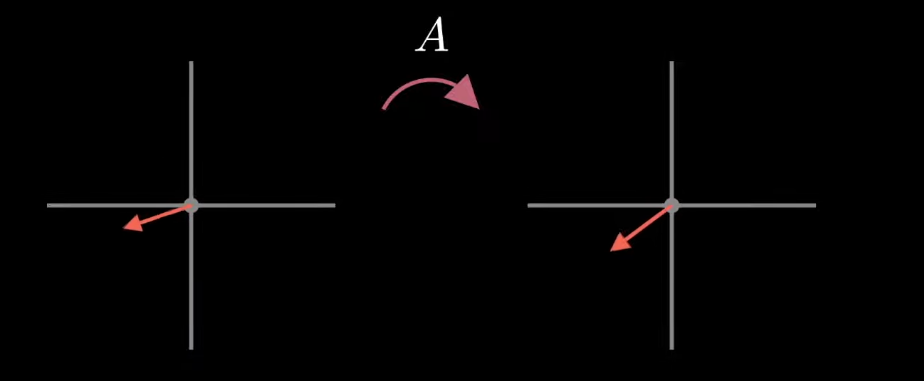
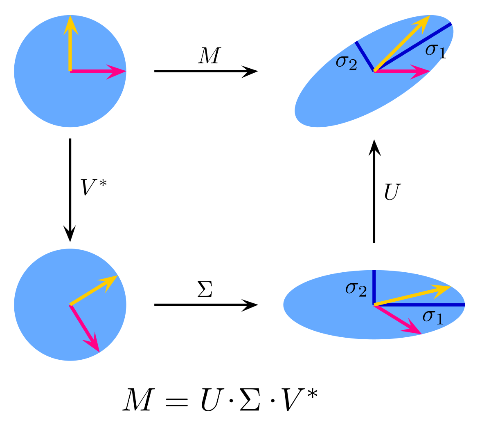
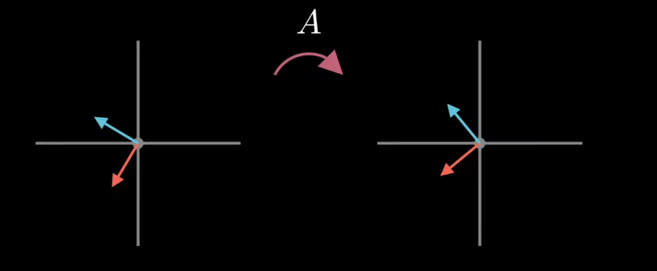
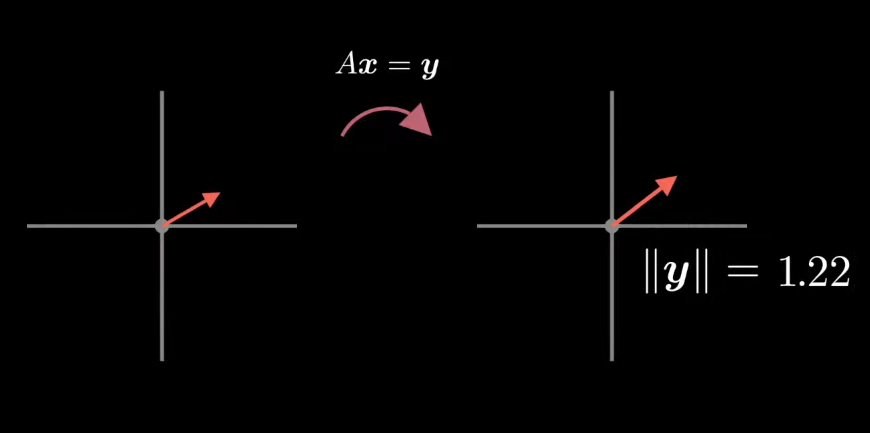
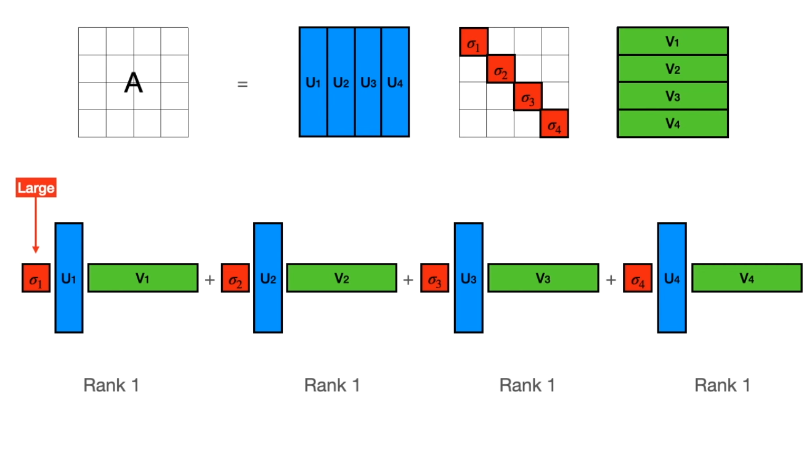
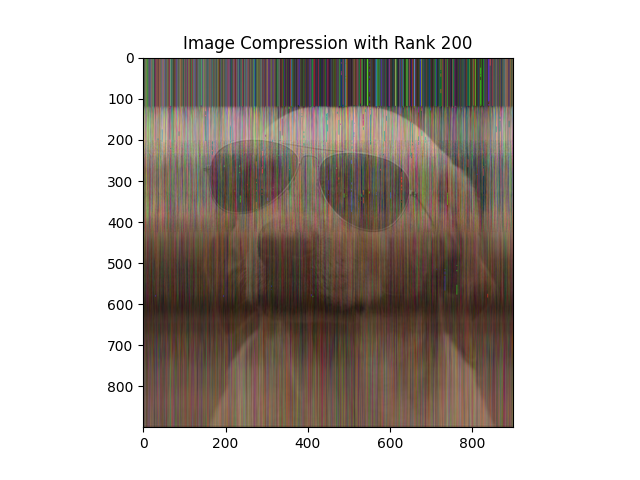
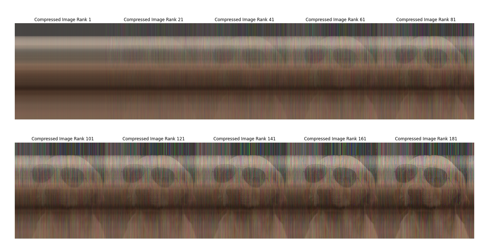
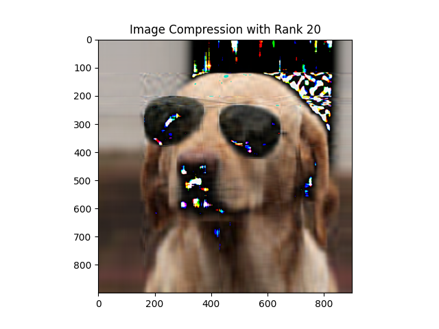
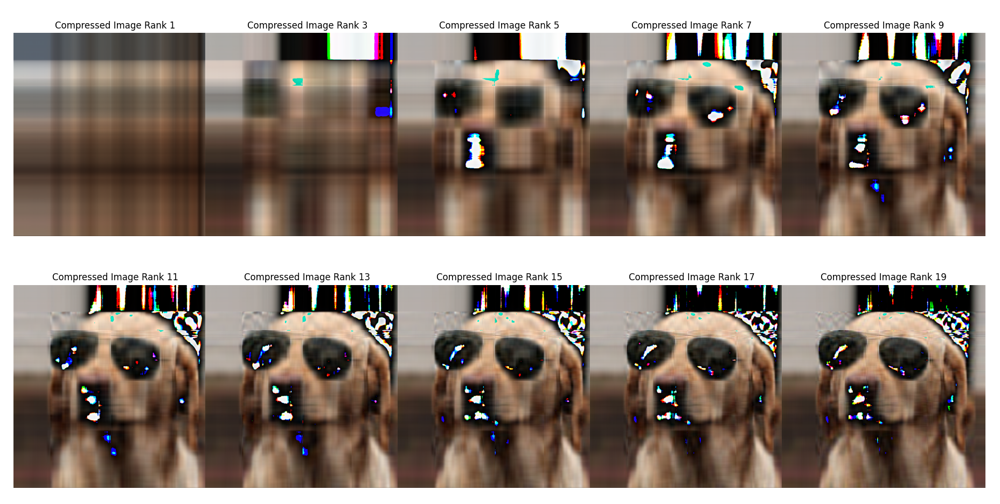
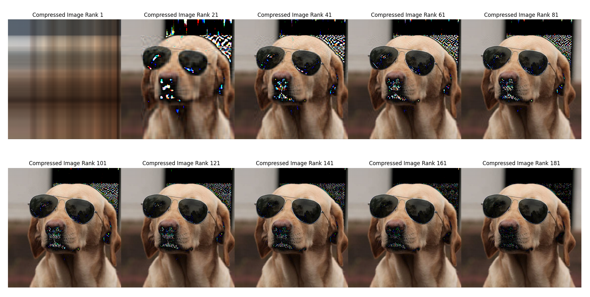

# Singular Value Decomposition (SVD)


Let us take a matrix as shown below 
```math
 A = \begin{bmatrix} a & b \\ c & d \end{bmatrix} 
\\ \text{If we use this matrix to transform any vector lets say X it can be done through dot prouct} \\
 A \cdot X 

```



The gist idea of Singular Value Decomposition(SVD) is to decompose a matrix like A into its different constituents such that if we do consecutive transformation throughs its constituents on any vector it would result similar transformation.



In the above figure M is similar to A matrix which has transformed the original circle into rotated and stretched like ellipse structure. The similar transformation can be achieved if we decompose M into different parts and do consecutive transformations.

**Matrix Transformation**

If we want to find the orthogonal set of vectors when transformed by \(A\) would remain orthogonal then. One way to find the orthogonal set of vectors is to first start with orthogonal set of vectors.



Let us say Red line is $`X`$ and Blue line is $`Y`$.

Now we rotate the X, Y full 360 and keep applying the transformation through \(A\) until we find the vector that even when transformed by \(A\) would remain orthogonal. These set of vectors are what defines the Singular Value Decomposition. The orthogonal vector is important because it is the property of rotation matrix. And we decompose the matrix into two part rotation and one stretching transformation in `SVD`.

Now we are at 2D but if we were to do it in very high dimensional data, the search method of finding the set of orthogonal vectors become difficult. We can find without search as follows:
```math
\begin{aligned}
A \mathbf{v_1} = \sigma_1 \mathbf{u_1} 
\\
A \mathbf{v_2} = \sigma_2 \mathbf{u_2}
\end{aligned}
```

In above `v` represents the vector and the result on the `RHS` is the transformed outcome which has been seperated into magnitude and its unit vector.

**Writing in matrix form:**
```math
\begin{aligned}
A \begin{bmatrix} \mathbf{v_1} & \mathbf{v_2} \end{bmatrix} = \begin{bmatrix} \mathbf{u_1} & \mathbf{u_2} \end{bmatrix} \begin{bmatrix} \sigma_1 & 0 \\ 0 & \sigma_2 \end{bmatrix} 
\\
A V = U \Sigma
\end{aligned}
```
So, we now have to solve for \(V\) and \(U\) which are set of orthogonal vectors. That is if we find this matrix, we can say we did singular value decomposition of matrix \(A\).

 
```math
AV = U \Sigma 
\\
A = U \Sigma V^T
```

### **Finding \( U \) and \( V \).**

**Finding \( V \):**
```math
\begin{aligned}
A^T A = (U \Sigma V^T)^T U \Sigma V^T
\\ \; \\
= V \Sigma^T U^T U \Sigma V^T
\\ \; \\
= V \Sigma^T \Sigma V^T
\\ \; \\
= V \Sigma^2 V^T
\end{aligned}
```
Since \( U \) is orthogonal

```math
U U^T = I
\\ \; \\
\Sigma \rightarrow \text{diagonal matrix}
```

Thus \( V \) is given by the eigen decomposition of \( A^T A \), and as \( A^T A \) is symmetric \( V \) being orthogonal vector property is also satisfied.

Similarly, we can find \( U \).
```math
A A^T = U \Sigma V^T V \Sigma^T U^T
\\ \; \\
= U \Sigma \Sigma^T U^T
\\ \; \\
A A^T = U \Sigma^2 U^T
```


**SVD finds the direction of maximum stretching.**


 
In mathematical terms: SVD solves:

```math
argmax \| A \mathbf{x} \| 
\\ \; \\
x :  \| \mathbf{x} \| = 1 

``` 
 

**We can mimic every linear transformation using: Rotation, Rescaling**

```math
 
\text{Any matrix:} \begin{pmatrix}
\cos \phi & \sin \phi \\
-\sin \phi & \cos \phi \\
\end{pmatrix}
\begin{pmatrix}
\sigma_1 & 0 \\
0 & \sigma_2 \\
\end{pmatrix}
\begin{pmatrix}
\cos \theta & \sin \theta \\
-\sin \theta & \cos \theta \\
\end{pmatrix}
 
```
 
**Higher rank matrix:**

Let is take an example of a matrix as shown below. Non of its rows or column are linearly dependent on each other . So its a rank 4 matrix.

```math

\begin{pmatrix}
3 & 1 & 4 & 1 \\
5 & 9 & 2 & 6 \\
5 & 3 & 5 & 8 \\
9 & 7 & 9 & 3 \\
\end{pmatrix}
```
Now if we want to reduce the information, then we divide this matrix into sum of `n` 1 rank matrix and utilize only some of them, which results in the compression.

```math
\begin{aligned}
\text{We turn the above high rank matrix into sum of 4 rank 1 matrices.}
\\ \; \\
= \sum_{i=1}^{4} \sigma_i \mathbf{u}_i \mathbf{v}_i^T

\\ \; \\
\text{We express it as a product}
\\ \; \\
\begin{pmatrix}
u_1 & u_2 & u_3 & u_4 \\
\end{pmatrix}
\begin{pmatrix}
v_1^T \\
v_2^T \\
v_3^T \\
v_4^T \\
\end{pmatrix}
\\ \; \\
\text{Now we expand like this:}
\\ \; \\
\sigma_1 \begin{pmatrix}
u_1 \\
\end{pmatrix}
\begin{pmatrix}
v_1^T \\
\end{pmatrix}
+ 
\sigma_2 \begin{pmatrix}
u_2 \\
\end{pmatrix}
\begin{pmatrix}
v_2^T \\
\end{pmatrix}
+ 
\sigma_3 \begin{pmatrix}
u_3 \\
\end{pmatrix}
\begin{pmatrix}
v_3^T \\
\end{pmatrix}
+ 
\sigma_4 \begin{pmatrix}
u_4 \\
\end{pmatrix}
\begin{pmatrix}
v_4^T \\
\end{pmatrix}
\end{aligned}
```

So if we consider this matrix as image then :



During compression we only take higher magnitudes and disregard rank 1 matrix with lower $`\sigma`$ values


## Image Compression using SVD

So from above theory, to compress any image, we consider the image as matrix and decompose into lower rank matrix and discards some of them.

### Code Implementation

**Finding SVD**

```python
U,S,VT =  np.linalg.svd(image)
```


For a RGB Image we divide it into different channels then perform compression and finally merge them.

```python
image = imread(image_path)
image = cvtColor(image,COLOR_BGR2RGB)
channels = []
for i in range(0,image.shape[-1]):
    U,S,VT =  np.linalg.svd(image[:,:,i])
    compressed_channel = U[:, :self.ranks] @ np.diag(S[:self.ranks])@VT[:self.ranks, :] 
    channels.append(compressed_channel)

compressed_image = np.stack((channels[0], channels[1],channels[2]), axis=2)
compressed_image = compressed_image.astype(np.uint8)
plt.title('Image Compression with Rank {}'.format(self.ranks))
plt.imshow(compressed_image)

```

## Results

### Using Custom SVD




### SVD from linalg
### Considering only 20 rank matrices






### Considering only 200 rank matrices





## Sample Bash Command

```bash
python main.py --ranks 20 --path dog.jpg
```

